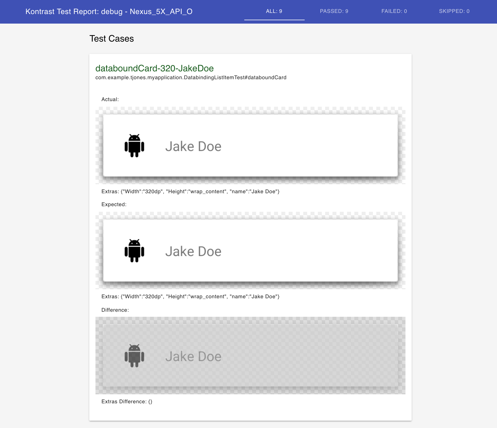
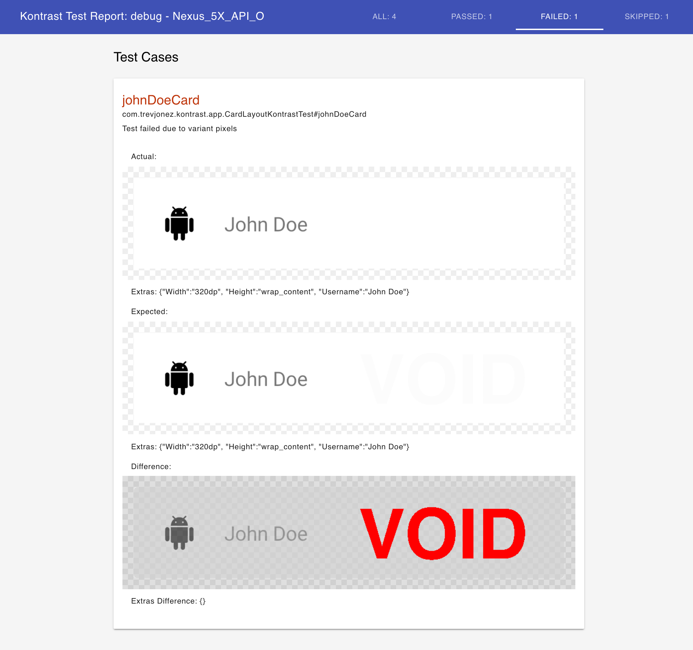

# Kontrast
[](https://jitpack.io/#trevjonez/kontrast)

View iteration and regression testing system for android.

## Usage

#### Installation
In the appropriate `build.gradle` file(s):
 
 1. Add the jitpack maven repository and classpath dependency. 
```groovy
buildscript {
    ext.kontrast_version = '0.1.0'
    repositories {
        maven { url "https://jitpack.io" }
    }
    dependencies {
        classpath "com.github.trevjonez.Kontrast:plugin:$kontrast_version"
    }
}
```

 2. Add the jitpack maven repository to your project repo config
 ```groovy
allprojects {
    repositories {
        maven { url "https://jitpack.io" }
    }
}
```

 3. Apply the plugin
```groovy
apply plugin: 'kontrast'
```

 4. Add the app client dependency (Optional, Recommended)
```groovy
dependencies {
    debugCompile "com.github.trevjonez.Kontrast:appClient:$kontrast_version"
}
```

 5. Alias your devices (Optional, Recommended)
```groovy
Kontrast {
    deviceAlias("8XV5T15A29007713", "TJones_Nexus_6P")
}
```
Emulators are automatically aliased to the name provided by the emulator console, however hardware devices are listed in adb by their ID.
The ID is sufficient but not human friendly so you can alias the device id for easier consumption.

 6. Specify the test key root directory (Optional)
```groovy
Kontrast {
    testKeyRoot file("...") //default is file(projectDir, "Kontrast")
}
```

 7. Specify target variants (Optional)
```groovy
Kontrast {
    targetVariant "ciDebug" //Only create tasks for ciDebug variant. can be called multiple times to create tasks for multiple variants.
}
```
 
#### Write your test cases

Start by creating a test in your `androidTest` directory for the given view/layout to be rendered. 
For convenience the plugin automatically includes the `androidTestClient` module to your project. 
This provides a pre-configured base test class you can extend for your kontrast tests, as well as some helper methods.
 
The `KontrastTestBase` will attempt to use the `KontrastActivity` via the `AppClient` by default.
Should you wish to change this, simply pass a different activity class literal to the super constructor to override this behavior.

```kotlin
class SomeViewTest: KontrastTestBase() {
    @Test
    @KontrastTest
    fun yourTestCase() {
        //layoutInflater from super class
        val view = layoutInflater.inflate(R.layout.some_layout, null).apply {
            text_view.text = name
        }
        
        //kontrastRule from super class
        kontrastRule.ofView(view)
                    .setWidthDp(320)
                    .extra("name", name) //meta information for the test report
                    .capture() //measure, layout, draw and send to host machine
    }    
}
```

The `androidTestClient` also provides a `CartesianProduct` class to help with creating parameter sets for using the junit parameterized test runner.
An example of this can be found in the [example project test cases](https://github.com/trevjonez/Kontrast/blob/master/example/app/src/androidTest/java/com/example/tjones/myapplication/PlainListItemTest.kt).
It is important to note that you should specify a `testKey` when using parameterized test in order to disambiguate the outputs. 

If you are using data binding it enforces that inflation occurs on the main thread. 
The `KontrastTestBase` includes an `inflateOnMainThread` helper method to make doing so simple. 
An example of this can be found in the [example project databinding test](https://github.com/trevjonez/Kontrast/blob/master/example/app/src/androidTest/java/com/example/tjones/myapplication/DatabindingListItemTest.kt).
 
#### Running Tests
For each connected device there will be six gradle tasks created. 
You will typically only invoke one of two tasks from the six created per device. 
They are as follows:
  1. `test{VariantName}KontrastTest_{DeviceAlias}`
  2. `capture{VariantName}TestKeys_{DeviceAlias}`
  
The test task will render all test cases and compare them against previously recorded keys for changes. 
The capture task will copy the results of a the render task into the test key directory.

The full list of tasks created per testable variant, per connected device, is as follows:
  1. `install{VariantName}Apk_{DeviceAlias}`
  2. `install{VariantName}TestApk_{DeviceAlias}`
  3. `render{VariantName}KontrastViews_{DeviceAlias}`
  4. `capture{VariantName}TestKeys_{DeviceAlias}`
  5. `test{VariantName}KontrastTest_{DeviceAlias}`
  6. `generate{VariantName}KontrastHtmlReport_{DeviceAlias}`
  
Any time the capture task is run it will also finalize that task by running the test task.
  
Any time the test task is run it will also finalize that task by running the generate html report task.
  
The render task will run `@KontrastTest` annotated test cases and reports back via instrumentation status so that it can then pull rendered PNG files as they are created. 
Once the PNG file has been pulled from the device it is deleted from the device in an attempt to avoid test output related storage bloat. 
Layout helper uses `Context.getExternalFilesDir(...)` so uninstalling the main apk should remove any remaining files.

The test task is a customized gradle test task that will produce an html and xml format junit report as usual.

The html report task is a very basic html report to enable viewing and comparison of screen shots.

## Report examples

The report attempts to deliver any relevant data for the test case. 
For now this is any included extras and the rendered screenshots.



On failing test cases the diff image will have any variant pixels marked in red.




## License
    Copyright 2017 Trevor Jones

    Licensed under the Apache License, Version 2.0 (the "License");
    you may not use this file except in compliance with the License.
    You may obtain a copy of the License at

        http://www.apache.org/licenses/LICENSE-2.0

    Unless required by applicable law or agreed to in writing, software
    distributed under the License is distributed on an "AS IS" BASIS,
    WITHOUT WARRANTIES OR CONDITIONS OF ANY KIND, either express or implied.
    See the License for the specific language governing permissions and
    limitations under the License.